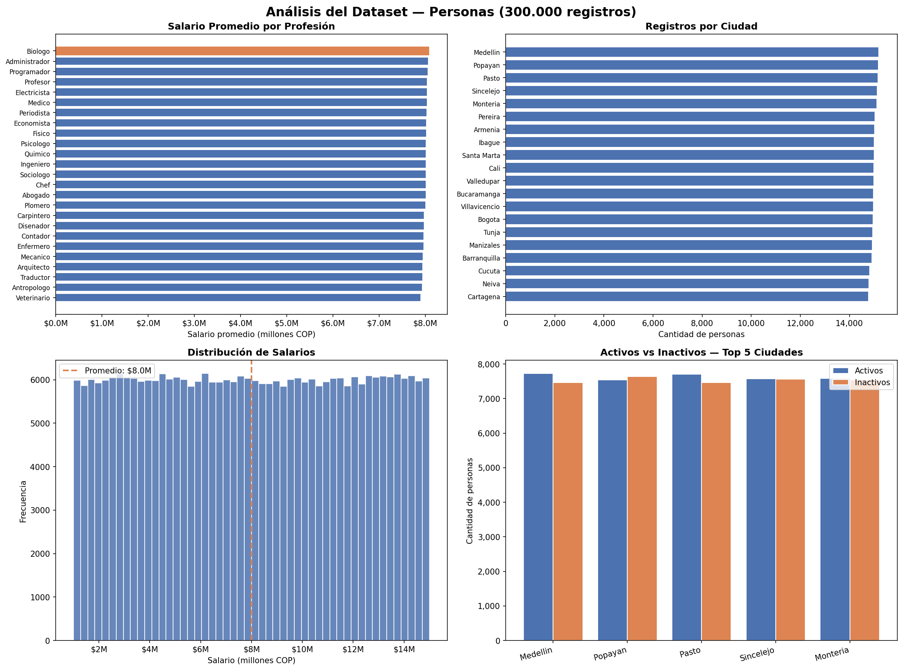

# 🧹 Taller de Python — Manejo y Limpieza de Datos
### Infraestructura para Grandes Volúmenes de Datos

---

## 📋 Descripción

Taller práctico de limpieza y análisis de datos sobre un dataset de **300.000 registros** con datos intencionalmente sucios. El objetivo es aplicar técnicas de limpieza robustas para responder 30 preguntas analíticas con precisión.

---

## 🗂️ Estructura del Repositorio

```
├── data/
│   └── personas.csv          # Dataset original (no modificar)
├── soluciones/
│   ├── 01.py ... 30.py       # Un script por ejercicio
├── limpieza_utils.py         # Módulo central de limpieza
├── verificar.py              # Ejecuta y verifica las 30 respuestas
├── visualizaciones.py        # Gráficas del análisis
└── README.md
```

---

## 🧪 Sobre el Dataset

- **Archivo:** `data/personas.csv`
- **Registros:** 300.000 filas
- **Columnas:** `id`, `nombre_cifrado`, `apellido_cifrado`, `ciudad`, `profesion`, `email`, `fecha_nacimiento`, `salario`, `activo`

---

## 🦠 Tipos de Suciedad Encontrados y Cómo se Limpiaron

| Columna | Problema | Solución aplicada |
|---|---|---|
| `nombre_cifrado` / `apellido_cifrado` | Cifrado ROT13 + caracteres especiales | `codecs.decode(rot_13)` + regex |
| `ciudad` | Espacios, `@#$*`, mayúsculas, **variantes truncadas** (`Mdllin`, `Bogot`, `Cli`) | Regex + diccionario de mapeo de 20 variantes |
| `profesion` | Igual que ciudad (`Mdico`, `Ingniro`, `Progrmdor`) | Regex + diccionario de mapeo de 19 variantes |
| `salario` | `$`, `@`, `%`, `aprox.`, **coma decimal** (`14024383,00`), **letra `l` → `1`**, **letra `O` → `0`** | Detección de patrón + sustitución antes de limpiar |
| `fecha_nacimiento` | Formatos `YYYY/MM/DD`, `YYYY.MM.DD`, espacio en el año (`19 92`), caracteres al inicio/fin | Normalización de separadores + regex para espacios internos |
| `activo` | `true/false`, `yes/no`, `si/no`, `1/0`, `TRUE/FALSE`, con `@`, `#`, `%`, espacios | `re.sub` sobre todos los no-alfanuméricos + lookup set |
| `email` | Espacios dentro del email (`ana @ gmail . com`), espacios al inicio/fin | `re.sub(r'\s+', '')` + `.lower()` |

---

## ▶️ Cómo Ejecutar

```bash
# Verificar todas las respuestas de una vez
 python verificar.py

# Ejecutar un ejercicio individual
 python soluciones/01.py

# Ver visualizaciones
 python visualizaciones.py
```

---

## ✅ Soluciones

| # | Ejercicio | Solución |
|---|-----------|----------|
| 01 | ¿Cuántas filas tienen el campo `id` con caracteres no numéricos? | `83648` |
| 02 | ¿Cuántas veces aparece el nombre "Maria" en el dataset? | `4160` |
| 03 | ¿Cuántas veces aparece el nombre "Juan" en el dataset? | `3986` |
| 04 | ¿Cuál es el nombre más frecuente y cuántas veces aparece? | `Gonzalo - 4221` |
| 05 | ¿Cuál es el apellido más frecuente y cuántas veces aparece? | `Reyes - 7490` |
| 06 | ¿Cuántos registros tienen la ciudad "Bogota" después de limpiar? | `14969` |
| 07 | ¿Cuántos registros tienen la ciudad "Medellin" después de limpiar? | `15193` |
| 08 | ¿Cuántas ciudades únicas existen después de normalizar? | `20` |
| 09 | ¿Cuántos registros tienen la profesión "Ingeniero" después de limpiar? | `12083` |
| 10 | ¿Cuántos registros tienen la profesión "Programador" después de limpiar? | `12062` |
| 11 | ¿Cuántas profesiones únicas existen después de normalizar? | `25` |
| 12 | ¿Cuántos registros tienen el campo `email` con espacios adicionales? | `45447` |
| 13 | ¿Cuántos registros tienen el campo `salario` con caracteres no numéricos? | `85266` |
| 14 | ¿Cuál es el salario promedio después de limpiar? | `8005689.17` |
| 15 | ¿Cuál es el salario máximo después de limpiar? | `14999995` |
| 16 | ¿Cuál es el salario mínimo después de limpiar? | `1000032` |
| 17 | ¿Cuántos registros tienen `activo` como verdadero después de normalizar? | `149863` |
| 18 | ¿Cuántos registros tienen `activo` como falso después de normalizar? | `150137` |
| 19 | ¿Cuántos registros tienen fecha de nacimiento con formato diferente a YYYY-MM-DD? | `89823` |
| 20 | ¿Cuántas personas nacieron entre 1990 y 2000 (inclusive)? | `53404` |
| 21 | ¿Cuántas personas nacieron antes de 1960? | `66577` |
| 22 | ¿Cuántas personas tienen más de 50 años (fecha actual: 2026-02-26)? | `144846` |
| 23 | ¿Cuántos registros tienen nombre "Carlos" y viven en "Cali"? | `187` |
| 24 | ¿Cuántos registros tienen nombre "Ana" y son "Medico"? | `172` |
| 25 | ¿Cuántos registros tienen profesión "Abogado" y salario > 10,000,000? | `4405` |
| 26 | ¿Cuántos registros tienen ciudad "Barranquilla", activos y nacidos después de 1980? | `3241` |
| 27 | ¿Cuál es la ciudad con más "Ingenieros"? | `Popayan` |
| 28 | ¿Cuál es la profesión con el salario promedio más alto? | `Biologo` |
| 29 | ¿Cuántos registros tienen email con dominio "gmail.com"? | `56462` |
| 30 | ¿Cuántos registros tienen nombre "Jose" y apellido "Garcia"? | `96` |

---

## 💡 Decisiones Técnicas Destacadas

### Variantes truncadas en ciudad y profesión
El dataset contiene variantes con vocales removidas (`Mdllin`, `Ingniro`, `Bogot`) que representan la misma entidad. Se construyeron diccionarios de mapeo para unificarlas correctamente, resultando en **20 ciudades** y **25 profesiones** reales — en lugar de 40 y 44 si se ignorara esta suciedad.

### Salarios con letra `l` y `O`
Algunos salarios tienen la letra `l` minúscula en lugar del dígito `1`, y `O` mayúscula en lugar de `0` (ej: `l0088323` → `10088323`). Sin esta corrección el valor se perdería o quedaría truncado.

### Salarios con coma decimal
Valores como `14024383,00` se interpretan correctamente tomando solo la parte entera, evitando que se conviertan en `1.400.238.300` (un valor absurdo).

### Fechas con múltiples formatos
Se detectaron y normalizaron 4 patrones adicionales al estándar: `YYYY/MM/DD`, `YYYY.MM.DD`, espacios dentro del año (`19 92-04-21`), y caracteres especiales al inicio/fin (`@1995-03-12`).

## 📊 Visualizaciones



---

## 📦 Dependencias

```bash
uv add pandas matplotlib
# o
pip install pandas matplotlib
```